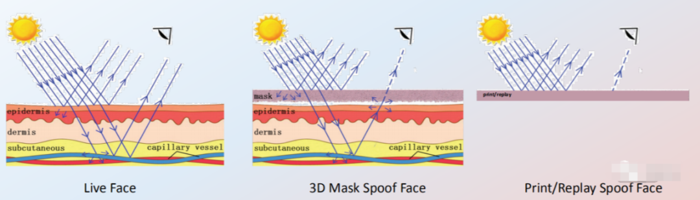
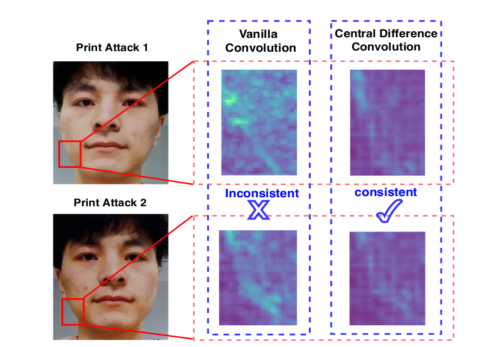
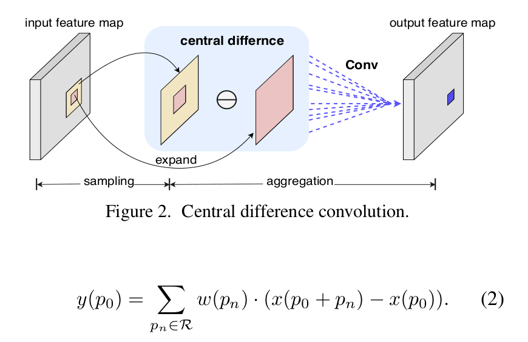
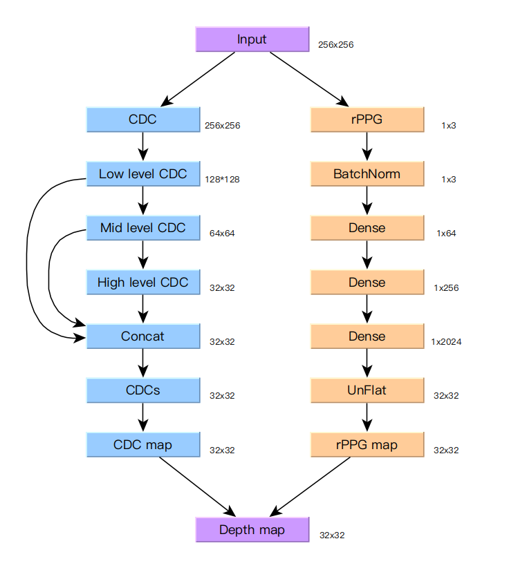
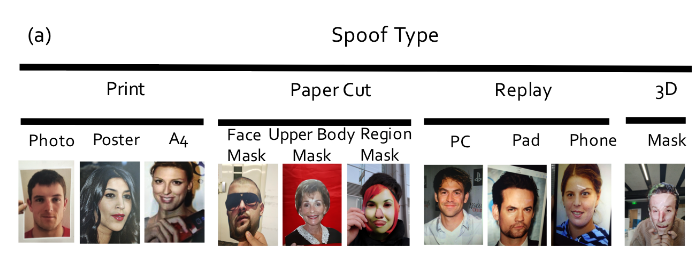
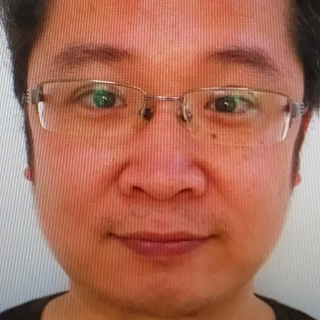
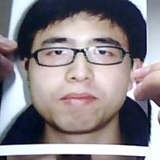
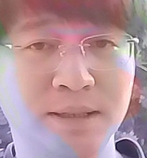

## 静态人脸反欺骗检测

### 问题描述

​		人脸反欺骗检测（Face Anti-Spoofing）是指判断捕捉到的人脸是真实人脸，还是伪造的人脸攻击（如：彩色纸张打印人脸图，电子设备屏幕中的人脸数字图像以及3D面具等）。目前基于普通相机照片的活体检测的方法，按输入的照片数量可以分为动态和静态两大类。动态检测基于多帧一定间隔时间的照片（或视频）；静态检测只基于一帧照片。总体来说，静态方法的检出能力较低。

​		在易惠人脸识别库应用中，受限于微信端照片采集的限制，以及减少前后端多次交互时延，目前人脸库识别只在后端进行静态检测。当有识别结果时，同时给出输入图片为假人脸的概率，作为可信度参考。为提高静态检测准确率，结合已出现的算法和模型，提出了融合rPPG和中心差分卷积的静态人脸检测模型和方法。

#### rPPG

​		rPPG远程光电体积描记术（Remote Photoplethysmography）利用反射的周围光来测量皮肤的细微亮度变化。皮肤的细微亮度变化是由于心脏跳动导致的血液流动导致的。一般通过rPPG 我们可以得到类似血容量脉冲（ BVP） 的信号，通过此信号可以预测心率，呼吸率等各种生命体征，在健康领域应用广泛。

​		如下图所示，如果是活体人脸，会有部分周围光穿过皮层到达血管，然后反射回相机，故相机是能监测到血液流动导致的亮度变化；而对于假人脸，由于材料不同，吸收及反射到相机的信息就很不同。以此可以作为判断是否存在人脸欺骗。

​		但也有缺陷，此方法比较依赖于相机采集照片的质量，例如光照、颜色还原等。对采集质量不高的照片，检出的准确率不稳定。并且，通常单独使用rPPG作为检测特征时，需要进行连续检测以获取脉冲信号变化，而在静态检测中，因为只存在一张照片，只能获取当前的rPPG特征数据。因此在静态检测中，rPPG可以作为辅助特征进行采集和使用。

#### 中心差分卷积（Central difference convolution, CDC）

​		原始的卷积运算通常直接聚合图像中局部强度的信息，因此：1）容易受到外界光照等因素的影响；2）比较难表征细粒度的特征。在人脸反欺骗检测任务中，前者容易导致模型的泛化能力较弱，如在未知的光照环境下测试性能较低；后者会导致模型难以学习到防欺骗本质的一些细节信息，如假人脸的材质特征等。中心差分卷积具有空间差分特征具有的较强光照不变性，同时也包含更细粒度的反欺骗线索（如栅格效应，屏幕反射等）。

中心差分卷积的算子和图示：

### 融合模型设计

​		考虑将rPPG与使用CDC算子的卷积神经网络进行结合，从而通过融合多种特征对输入图像进行判断。融合模型设计如下图所示：

**训练过程：**

1. 输入的照片先进行人脸检测和提取，进行相应前处理，作为输入向量Input
2. 模型分两路，一路（右侧）对输入向量进行rPPG特征提取，然后经过正则化（BatchNorm）和多层全连接网络（Dense），生成rPPG特征向量（rPPG map）
3. 第二路（左侧）输入向量经过若干层CDC算子的卷积网络，生成CDC特征向量（CDC map）
4. 将两个特征向量进行合并计算后，即得到最终的特征向量（Depth map），与目标特征计算损失值，完成一次训练。

**训练数据：**

​		数据集使用开源的 **CelebA-Spoof**数据集。真人脸数据使用数据集中的真人数据，欺骗数据从数据集中筛选假人脸材质为：照片、A4打印、纸面具、PC、平板、手机。真人的目标特征向量使用灰度人脸图转换尺寸得到，假人目标特征向量全部为零。

### 模型效果

​		使用**CelebA-Spoof**的验证集可以得到大于0.87的准确率。在现实应用中，对采集质量较高的照片可以进行正确检测，对采集质量不高的照片，检出效果不稳定。

|      | 照片                                                  | 假人脸的概率 | 说明                           |
| ---- | ----------------------------------------------------- | ------------ | ------------------------------ |
| 1    |  | 0.0491       | 手机拍摄真人（采集质较高）     |
| 2    |  | 0.9879       | 手机拍摄电脑屏幕（采集质较高） |
| 3    |  | 0.9753       | 网上下载手持照片（采集质量低） |
| 4    |  | 0.8368       | 道闸采集真人（采集质量低）     |
| 5    |  | 0.2609       | 道闸采集真人（采集质量低）     |

### 参考文献

Learning Deep Models for Face Anti-Spoofing: Binary or Auxiliary Supervision [https://arxiv.org/abs/1803.11097](https://arxiv.org/abs/1803.11097) 

Searching Central Difference Convolutional Networks for Face Anti-Spoofing [https://arxiv.org/abs/2003.04092](https://arxiv.org/abs/2003.04092)

